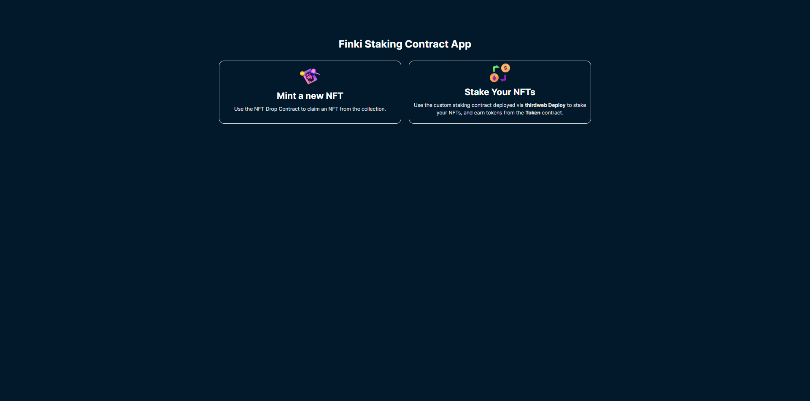
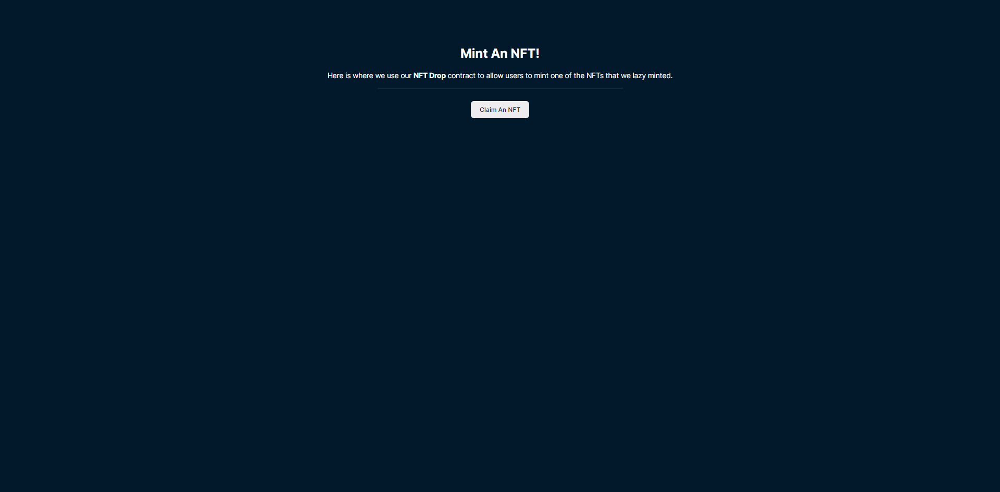
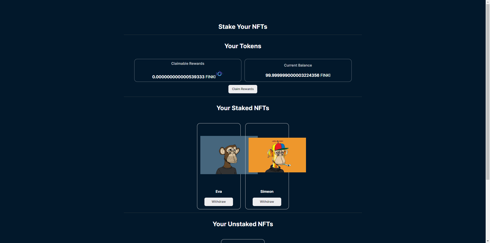

# Staking NFTs with ERC20 Rewards

## Overview

This project allows users to stake ERC721 NFTs in exchange for ERC20 tokens as rewards. It is built using Next.js with TypeScript and involves several steps to set up and run successfully. Below, you will find a step-by-step guide on how to create and deploy the entire project.

## Prerequisites

Before you begin, make sure you have the following prerequisites:

- [MetaMask](https://metamask.io/) wallet installed, connected to the Mumbai Blockchain.
- Access to a [ThirdWeb](https://thirdweb.io/) account.
- Node.js and npm (Node Package Manager) installed on your system.

## Step-by-Step Guide

### 1. MetaMask Wallet Setup

Ensure you have the MetaMask wallet installed and configured on the Mumbai Blockchain. This wallet will be used to interact with the deployed contracts.

### 2. ERC721 NFT Smart Contract

Create and deploy an ERC721 NFT smart contract on ThirdWeb. This contract will represent the NFTs that users can stake.

### 3. ERC20 Token Smart Contract

Create and deploy an ERC20 token smart contract on ThirdWeb. This contract will serve as the reward token for staking.

### 4. StakeERC721 Smart Contract

Create and deploy a StakeERC721 smart contract on ThirdWeb. This contract will handle the staking logic and distribution of ERC20 rewards.

### 5. Approval for Staking

Users must approve the NFT Staking contract to transfer their ERC721 tokens. Ensure you have a mechanism in your front-end to allow users to approve this contract.

### 6. Deposit Tokens

Users can then deposit their ERC721 tokens into the NFT Staking contract. Implement this functionality in your front-end.

### 7. ThirdWeb API Key

Create an API key on ThirdWeb to interact with your deployed smart contracts programmatically.

### 8. Front-End Development

Develop the front-end of your project using Next.js with TypeScript. Utilize the API key and MetaMask integration for interacting with the smart contracts and displaying staking information to users.

## Running the Project

To run the project locally, follow these steps:

1. Clone this repository to your local machine.
2. Navigate to the project directory.
3. Run `npm install` to install the project dependencies.
4. Run `npm run dev` to start the Next.js development server.

## Additional Information

- Make sure to handle security and user authentication appropriately in your project to protect users' assets and data.
- Document your smart contract ABI and addresses for easy integration with your front-end.
- Ensure that you follow best practices for code quality, security, and gas optimization in your smart contracts.

## License

This project is licensed under the [MIT License](LICENSE).

Happy staking!
